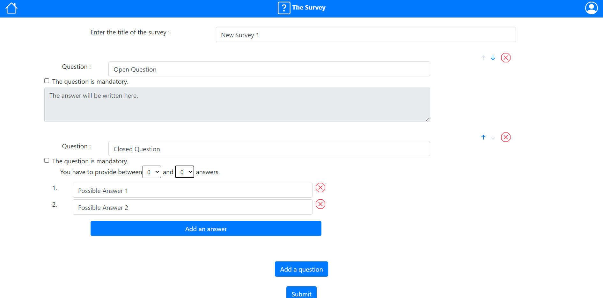

# Exam #1: "Survey"
## Student: s286615 CAM MARTIN

## React Client Application Routes

- Route `/`: Main page - Display all the surveys available (+ a header and a sidebar).
- Route `/login`: LogIn page - Allow a user to log in. If already logged in, it redirect to `/`.
- Route `/survey/:surveyId`: Answer to a Survey page - Allow a user to answer to the survey identified by the param. The param must be a number that identifies a survey.
- Route `/mySurveys`: User's Surveys page - Display all the surveys published by the user (+ a header and a sidebar).
- Route `/check-survey/:surveyId`: All answers to a Survey page - Display all the answers to the survey identified by the param. The param must be a number that identifies a survey published by the logged in user.
- Route `/new`: Creation of a Survey - If the user is logged in, allow to create and publish a new Survey.

## API Server

- GET `/survey`
  - Request parameters : *None*
  - Request body : *None*
  - Response : `200 OK` (success) or `500 Internal Server Error` (generic error)
  - Response body : An Array of Objects, each describing a survey.
  ```
  [{ 
    surveyId: 1, 
    title: 'How do you feel ?', 
    userId: 1 
  },{ 
    surveyId: 2, 
    title: 'How are you ?', 
    userId: 2 
  },{
    surveyId: 3,
    title: 'Exam 1',
    userId: 2 
  }]
  ```
- POST `/survey`
  - Request parameters : *None*
  - Request body : An Object containing all the informations about the survey to be publied.
  ```
  {
    title: 'New Survey',
    questions: [
    {
      title: 'Open Question',
      type: 'open',
      mandatory: false,
      content: ''
    }, {
      title: 'Closed Question',
      type: 'closed',
      mandatory: false,
      content: [Array],
      min: 0,
      max: 0
    }]
  }
  ```
  - Response : `200 OK` (success) or `500 Internal Server Error` (generic error)
  - Response body : *None*
- GET `/survey/<id>`
  - Request parameters : The ID identifying the survey we want to get info about.
  - Request body : *None*
  - Response : `200 OK` (success) or `500 Internal Server Error` (generic error)
  - Response body : An Array of one Object, describing the survey identified by the ID in parameters.
  ```
  [{ 
    surveyId: 1, 
    title: 'How do you feel ?', 
    userId: 1 
  }]
  ```
- GET `/publied`
  - Request parameters : *None*
  - Request body : *None*
  - Response : `200 OK` (success) or `401 Unauthorized` (not logged in) or `500 Internal Server Error` (generic error)
  - Response body : An Array of Objects, each describing a survey, publied by the user currently logged in .
  ```
  [{ 
    surveyId: 2, 
    title: 'How are you ?', 
    userId: 2 
  },{
    surveyId: 3,
    title: 'Exam 1',
    userId: 2 
  }]
  ```
- GET `/questions/<id>`
  - Request parameters : The ID identifying the survey of which we want the questions.
  - Request body : *None*
  - Response : `200 OK` (success) or `500 Internal Server Error` (generic error)
  - Response body : An Array of Objects, describing the questions associed to the survey identified by the ID given in parameters.
  ```
  [{ 
    questionId: 2,
    surveyId: 2, 
    title: 'How are you ?', 
    open: 0,
    mandatory: 1
  }, {
    questionId: 3,
    surveyId: 2, 
    title: 'Do you want to tell me a little bit more about that ?', 
    open: 1,
    mandatory: 0
  }]
  ```
- GET `/answers/<id>`
  - Request parameters : The ID identifying the closed question of which we want the possible answers and some more informations.
  - Request body : *None*
  - Response : `200 OK` (success) or `500 Internal Server Error` (generic error)
  - Response body : An Array of one Object, giving more informations about the closed question identified by the ID given in parameters, such as the min and max answers to provide or the possibles answers.
  ```
  [{ 
    questionId: 2,
    min: 1, 
    max: 1, 
    options: '[{"key": 1, "value": "Everything is fine"}, {"key": 2, "value": "I am okay"}, {"key": 3, "value": "Not so bad"}, {"key": 4, "value": "I am sad"}]'
  }]
  ```
- POST `/response`
  - Request parameters : *None*
  - Request body : An Object containing the information about the answer provided by a user on a question.
  ```
  {
    username: 'UserLambda',
    questionId: 2,
    content: '[true, false, false, false]'
  }
  ```
  - Response : `200 OK` (success) or `500 Internal Server Error` (generic error)
  - Response body : *None*
- GET `/author/<id>`
  - Request parameters : The ID identifying the survey of which we want to know the author.
  - Request body : *None*
  - Response : `200 OK` (success) or `500 Internal Server Error` (generic error)
  - Response body : An Array of one Object, containing the login of the author of the survey.
  ```
  [{ 
    name: NickTheBetterAdmin
  }]
  ```
- GET `/numberResponses/<id>`
  - Request parameters : The ID identifying the survey of which we want to know the number of responses posted by users.
  - Request body : *None*
  - Response : `200 OK` (success) or `500 Internal Server Error` (generic error)
  - Response body : An Array of one Object, containing the total of responses posted.
  ```
  [{ 
    total: 3
  }]
  ```
- GET `/responseList/<id>`
  - Request parameters : The ID identifying the survey of which we want to get the list of answers ID.
  - Request body : *None*
  - Response : `200 OK` (success) or `500 Internal Server Error` (generic error)
  - Response body : An Array of Objects, containing the sID of the answers of the survey identified by the ID given in parameters and publied by the user logged in. If the user logged in is not the author of the survey, it will return an empty array.
  ```
  [{ 
    sId: 4
  }, {
    sId: 5
  }, {
    sId: 6
  }]
  ```
- GET `/response/<id>`
  - Request parameters : The ID identifying the response we want to get.
  - Request body : *None*
  - Response : `200 OK` (success) or `500 Internal Server Error` (generic error)
  - Response body : An Array of Objects, describing the responses provided at the same time by the same user (with the same sId, given in parameters)
  ```
  [{ 
    sId: 4,
    username: Harry Potter, 
    questionId: 4, 
    content: "[true, false, false, false]"
  }, {
    sId: 4,
    username: Harry Potter,
    questionId: 5,
    content: "[true, false, false, false]"
  }, {
    sId: 4,
    username: Harry Potter,
    questionId: 6,
    content: "I don't know."
  }]
  ```
- POST `/login`
  - Request parameters : *None*
  - Request body : An Object containing the credentials of the user wanting to log in.
  ```
  {
    username: 'JohnTheAdmin',
    password: 'password'
  }
  ```
  - Response : `200 OK` (success) or `401 Unauthorized` (bad credentials) or `500 Internal Server Error` (generic error)
  - Response body : An Array of one Object containing the user informations.
  ```
  {
    id: 1,
    username: 'JohnTheAdmin'
  }
  ```
- GET `/current`
  - Request parameters : *None*
  - Request body : *None*
  - Response : `200 OK` (success) or `401 Unauthorized` (bad credentials) or `500 Internal Server Error` (generic error)
  - Response body : An Array of one Object containing the user informations.
  ```
  {
    id: 1,
    username: 'JohnTheAdmin'
  }
  ```
- DELETE `/current`
  - Request parameters : *None*
  - Request body : *None*
  - Response : `200 OK` (success) or `401 Unauthorized` (not logged in) or `500 Internal Server Error` (generic error)
  - Response body : An Array of one Object containing the user informations.
  ```
  {
    id: 1,
    username: 'JohnTheAdmin'
  }
  ```


## Database Tables

- Table `users` - contains usersId, login, password - Used for the LogIn and the identification of the users
- Table `survey` - contains surveyId, title, userId - Used to store the title and the author of the user
- Table `questions` - contains questionId, surveyId, title, open, mandatory - Used to store the title of the question, its ID, the survey it comes from, and the rules applied to it.
- Table `answers` - contains questionId, min, max, options - Used to store the different options of a CLOSED question (there is no answers element for OPEN questions), and the min and max answers you can check.
- Table `responses` - contains sId, username, questionId, content - Used to store the answers to a survey. sId is the same for all the answers, allowing a user to answer 2 times to the same survey. Content is a JSON containing the answer to the question.

## Main React Components

- `Main` (in `App.js`): Display the list of all surveys and a link to answer them
- `SurveyAnswer` (in `App.js`): Display all the questions and allow a user to complete them, then check the validity and submit the survey
- `SurveyPublied` (in `App.js`): Display all the surveys publied by the user logged in and a link to check the answers
- `AllResponseCheck` (in `App.js`): Display the answers of the users one at a time. Allow switching between answers with arrows.
- `NewSurvey` (in `App.js`): Display the creator of surveys. Allow the administrator to add a title and questions.

## Screenshot



## Users Credentials

- JohnTheAdmin, password 
- NickTheBetterAdmin, betterPassword
